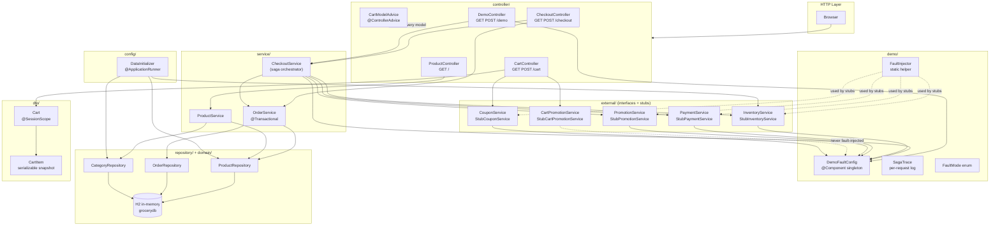
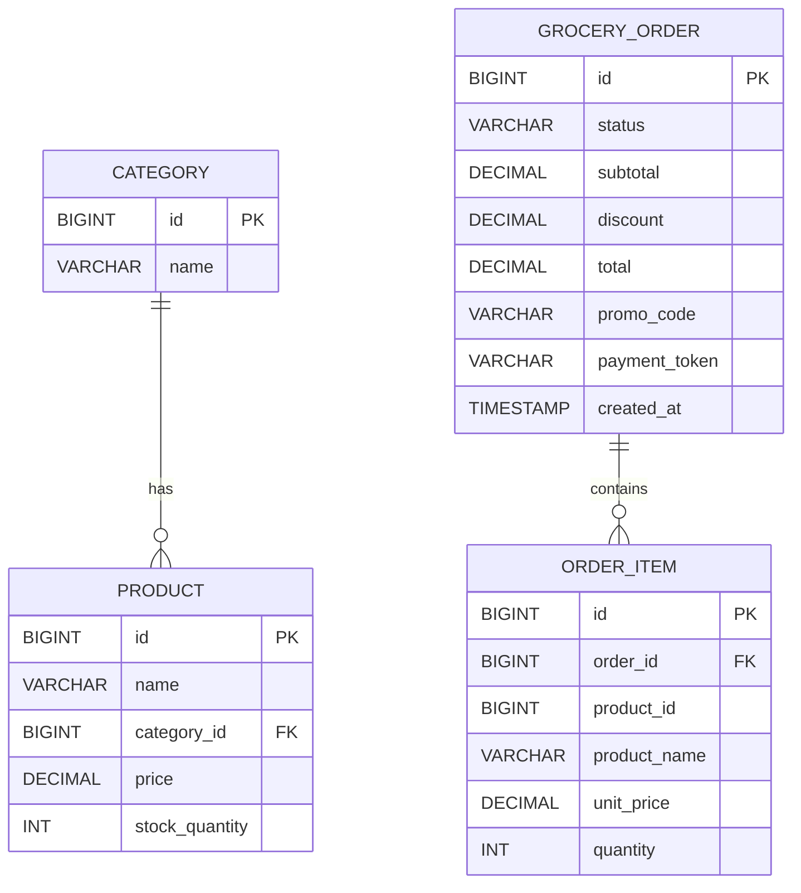

# Architecture

This document describes the static structure of the Fresh Groceries demo application: its layers, components, dependencies, and the conventions that govern how they are wired together.

---

## Contents

1. [Overview](#overview)
2. [Technology Stack](#technology-stack)
3. [Layer Map](#layer-map)
4. [Component Diagram](#component-diagram)
5. [Package Structure](#package-structure)
6. [Layer Details](#layer-details)
   - [Controllers](#controllers)
   - [Services](#services)
   - [External Service Stubs](#external-service-stubs)
   - [Demo / Chaos Infrastructure](#demo--chaos-infrastructure)
   - [Domain and Persistence](#domain-and-persistence)
   - [Session State (Cart)](#session-state-cart)
   - [Configuration](#configuration)
   - [Exceptions](#exceptions)
7. [Dependency Injection Conventions](#dependency-injection-conventions)
8. [Database Schema](#database-schema)
9. [Stock: Two Sources of Truth](#stock-two-sources-of-truth)

---

## Overview

The application is a Spring Boot 3 / Java 17 monolith built with Spring MVC and Thymeleaf. It demonstrates distributed systems patterns — specifically the Saga pattern with compensating transactions — within a self-contained process that requires no external infrastructure. All "external" services (inventory, payment, promotions, coupon engine) are in-memory stubs wired via interfaces, making them swappable without changing business logic.

---

## Technology Stack

| Layer | Technology |
|---|---|
| Language | Java 17 |
| Framework | Spring Boot 3.4 |
| Web / MVC | Spring MVC + Thymeleaf |
| Persistence | Spring Data JPA + Hibernate |
| Database | H2 (in-memory, `jdbc:h2:mem:grocerydb`) |
| Build | Maven 3 (wrapper included) |
| CSS | Bootstrap 5.3 (CDN) |

---

## Layer Map



---

## Package Structure

```
src/main/java/com/demo/grocery/
├── GroceryApplication.java            Spring Boot entry point
├── config/
│   └── DataInitializer.java           Seeds categories, products, inventory on startup
├── controller/
│   ├── CartController.java            /cart — add, update, remove, clear, view
│   ├── CartModelAdvice.java           @ControllerAdvice — cartItemCount + categories
│   ├── CheckoutController.java        /checkout — form, submit, confirmation
│   ├── DemoController.java            /demo — chaos panel + Run Test endpoint
│   └── ProductController.java         / — product catalogue with category filter
├── demo/
│   ├── DemoFaultConfig.java           Singleton holding all volatile fault settings
│   ├── FaultInjector.java             Static dispatch: throws or sleeps by FaultMode
│   ├── FaultMode.java                 Enum: NORMAL | DOWN | SLOW | FLAKY
│   └── SagaTrace.java                 Per-request step log with OK/FAILED/COMPENSATED/SKIPPED/DEGRADED
├── domain/
│   ├── Category.java                  JPA entity — product category
│   ├── Order.java                     JPA entity — confirmed/cancelled order
│   ├── OrderItem.java                 JPA entity — line item snapshot (no FK to Product)
│   ├── OrderStatus.java               Enum: CONFIRMED | CANCELLED
│   └── Product.java                   JPA entity — name, price, cached stock level
├── dto/
│   ├── Cart.java                      @SessionScope bean — items + two discount streams
│   ├── CartItem.java                  Price-locked snapshot of a product at add-time
│   └── CheckoutRequest.java           Form-binding POJO — card details + promo code + idempotency key
├── exception/
│   ├── CheckoutException.java         Wraps saga failures after side effects have occurred
│   ├── InsufficientStockException.java Step 1 failure — carries productId, available, requested
│   ├── InvalidPromotionException.java  Bad promo code — caught separately for inline form error
│   ├── PaymentFailedException.java     Card declined — carries declineCode
│   └── ServiceUnavailableException.java External service DOWN/FLAKY — optional compensationNote
├── external/
│   ├── cartpromotion/
│   │   ├── CartDeal.java              Record: productName, description, discount
│   │   ├── CartDealHint.java          Record: description, threshold (for UI hints)
│   │   ├── CartPromotionResult.java   Record: list of CartDeal + totalDiscount
│   │   ├── CartPromotionService.java  Interface: evaluate(items), getAvailableDeals()
│   │   └── stub/StubCartPromotionService.java
│   ├── coupon/
│   │   ├── CouponOffer.java           Record: offerId, label, detail, OfferType, discount
│   │   ├── CouponOfferHint.java       Record: offerId, label, hint (static catalog)
│   │   ├── CouponResult.java          Record: list of CouponOffer + totalDiscount
│   │   ├── CouponService.java         Interface: evaluate(items), getOfferCatalog()
│   │   ├── OfferType.java             Enum: BOGO | BUNDLE | QUANTITY_OFF | SPEND_THRESHOLD
│   │   └── stub/StubCouponService.java
│   ├── inventory/
│   │   ├── InventoryReservation.java  Record: reservationId, items map
│   │   ├── InventoryService.java      Interface: checkAvailability, reserveStock, commitReservation, releaseReservation, getStock
│   │   └── stub/StubInventoryService.java
│   ├── payment/
│   │   ├── PaymentRequest.java        Record: cardNumber, cardHolderName, amount, idempotencyKey
│   │   ├── PaymentResult.java         Record: paymentToken, amount, status
│   │   ├── PaymentService.java        Interface: processPayment, refund
│   │   ├── PaymentStatus.java         Enum: SUCCESS | FAILED
│   │   └── stub/StubPaymentService.java
│   └── promotion/
│       ├── PromotionResult.java       Record: code, description, discount
│       ├── PromotionService.java      Interface: applyPromotion(code, subtotal)
│       └── stub/StubPromotionService.java
├── repository/
│   ├── CategoryRepository.java        JpaRepository<Category, Long>
│   ├── OrderRepository.java           JpaRepository<Order, Long>
│   └── ProductRepository.java         JpaRepository + custom @Modifying decrementStock
└── service/
    ├── CheckoutService.java           Saga orchestrator — intentionally NOT @Transactional
    ├── OrderService.java              @Transactional DB writes: createOrder, cancelOrder
    └── ProductService.java            findAll, findByCategory, findById, findAllCategories
```

---

## Layer Details

### Controllers

Controllers handle HTTP routing and map domain exceptions to UI messages. They never contain business logic — that lives in services.

| Controller | Routes | Responsibility |
|---|---|---|
| `ProductController` | `GET /` | Product catalogue; supports `?category=` filter |
| `CartController` | `GET /cart`, `POST /cart/add`, `POST /cart/update`, `POST /cart/remove`, `POST /cart/clear` | Cart CRUD + discount refresh on every mutation |
| `CheckoutController` | `GET /checkout`, `POST /checkout`, `GET /checkout/confirmation/{id}` | Checkout form, saga invocation, exception-to-UI mapping, confirmation page |
| `DemoController` | `GET /demo`, `POST /demo`, `POST /demo/preset`, `POST /demo/run` | Chaos panel: read/write `DemoFaultConfig`; apply presets; run headless test checkout |
| `CartModelAdvice` | All controllers | `@ControllerAdvice` that injects `cartItemCount` and `categories` into every Thymeleaf model automatically |

`CheckoutController` catches five distinct exception types and maps each to a specific UI message + rollback note:

| Exception | UI path |
|---|---|
| `InsufficientStockException` | "Some items are no longer available" |
| `InvalidPromotionException` | Inline promo error on form field |
| `PaymentFailedException` | "Payment failed" + rollback confirmation |
| `ServiceUnavailableException` | "Service unavailable" + optional compensation note |
| `CheckoutException` | "Checkout failed" + full compensation note |

### Services

`CheckoutService` is the saga orchestrator. It is intentionally not `@Transactional` because the saga spans external services that cannot participate in a single JDBC transaction. See [FLOW.md](FLOW.md) for the full saga sequence and compensation map.

`OrderService` performs the two `@Transactional` DB operations: `createOrder` (writes `Order` + `OrderItem` rows and decrements `Product.stockQuantity`) and `cancelOrder` (sets `order.status = CANCELLED`).

`ProductService` is a thin read-only wrapper over `ProductRepository` and `CategoryRepository`.

### External Service Stubs

Every external service follows the same four-file pattern:

```
external/{name}/
  {Name}Service.java         Interface — the contract
  {Name}Request.java         Request record (immutable)
  {Name}Result.java          Response record (immutable)
  stub/Stub{Name}Service.java @Service implementation
```

Spring auto-wires the stub because it is the only `@Service` implementing the interface. To deploy a real implementation, annotate it `@Service @Profile("prod")` and annotate the stub `@Profile("!prod")`.

All stubs except `StubCartPromotionService` read `DemoFaultConfig` on every call and delegate to `FaultInjector.apply()` to decide whether to throw or sleep. `CartPromotionService` is never fault-injected.

### Demo / Chaos Infrastructure

`DemoFaultConfig` is a singleton `@Component` holding `volatile` fields (thread-safe for single reads/writes without synchronization). It exposes one `FaultMode` per injectable fault point and two shared timing parameters (`slowDelayMs`, `paymentTimeoutMs`).

`FaultInjector.apply(mode, label, slowMs, flakyCounter)` is the single dispatch point called inside every injectable stub method. DOWN and FLAKY throw `ServiceUnavailableException`; SLOW calls `Thread.sleep(slowMs)`.

`SagaTrace` accumulates a per-request list of `Step` records (number, operation, status, detail). `CheckoutService` logs each saga step into the trace. `CheckoutController` attaches the completed trace to the model so the Thymeleaf template renders a colour-coded execution log on any checkout failure.

### Domain and Persistence

| Entity | Table | Notes |
|---|---|---|
| `Category` | `category` | Simple name; parent of Product |
| `Product` | `product` | Cached `stockQuantity` — display only, not authoritative |
| `Order` | `grocery_order` | `status`, `subtotal`, `discount`, `total`, `promoCode`, `paymentToken`, `createdAt` |
| `OrderItem` | `order_item` | Snapshot: `productId`, `productName`, `unitPrice`, `quantity` — no FK to `product` so orders survive product changes |
| `OrderStatus` | (enum column) | `CONFIRMED` \| `CANCELLED` |

`ProductRepository` adds one custom JPQL query:

```java
@Modifying
@Query("UPDATE Product p SET p.stockQuantity = p.stockQuantity - :qty WHERE p.id = :id AND p.stockQuantity >= :qty")
int decrementStock(@Param("id") Long productId, @Param("qty") int quantity);
```

This is called inside `OrderService.createOrder()` to keep the display cache roughly accurate after a confirmed order.

### Session State (Cart)

`Cart` is a `@SessionScope @Component`. Spring creates one instance per HTTP session via a CGLIB proxy and serializes it when the session is persisted. It stores `CartItem` snapshots (productId, name, price at time of adding) to prevent price-drift if a product's price changes mid-session.

`Cart` holds two independent discount streams:
- `cartPromotion` (`CartPromotionResult`) — quantity-based automatic deals from `CartPromotionService`
- `couponResult` (`CouponResult`) — cart-level offers from `CouponService`

`getEffectiveTotal()` returns `subtotal - cartPromotionDiscount - couponDiscount`. In `CheckoutService`, a third discount (the promo code from `PromotionService`) is subtracted inline to produce `finalTotal`.

### Configuration

`DataInitializer` implements `ApplicationRunner` and seeds all data on every startup inside a single `@Transactional` method. It creates four `Category` rows, 16 `Product` rows, and mirrors each product's stock into `StubInventoryService.available` via `initializeStock()`.

### Exceptions

| Exception | Thrown by | Caught by |
|---|---|---|
| `InsufficientStockException` | `StubInventoryService.checkAvailability` | `CheckoutController` |
| `InvalidPromotionException` | `StubPromotionService.applyPromotion` | `CheckoutController` |
| `PaymentFailedException` | `StubPaymentService.processPayment` | `CheckoutController` (via `ExecutionException` unwrap in `CheckoutService`) |
| `ServiceUnavailableException` | All injectable stubs via `FaultInjector` | `CheckoutController`; `CartController.refreshDiscounts()` for coupon failures |
| `CheckoutException` | `CheckoutService` (wraps failures at Steps 5–6) | `CheckoutController` |

`ServiceUnavailableException` carries an optional `compensationNote` string that the controller passes directly to the template so users see exactly which compensations ran.

---

## Dependency Injection Conventions

- Constructor injection throughout — no field injection, no `@Autowired` on fields.
- External service interfaces are injected into `CheckoutService`; only the stub `@Service` implementations exist, so Spring resolves them automatically.
- `Cart` is injected into controllers as a CGLIB proxy; services receive it as a method parameter, never hold it as a field. This keeps session state out of singleton beans.
- `DemoFaultConfig` is a singleton injected into stubs; stubs read it on each call, not at construction time.

---

## Database Schema



`ORDER_ITEM.product_id` is a plain column, not a foreign key — it preserves the snapshot of what the customer bought even if the product row is later deleted or modified.

---

## Stock: Two Sources of Truth

| Source | Location | Updated when | Used for |
|---|---|---|---|
| `StubInventoryService.available` | `ConcurrentHashMap` in-memory | On `reserveStock` (decrement) and `releaseReservation` (increment) | Authoritative for checkout; prevents overselling |
| `Product.stockQuantity` | H2 `product` table | Only after a confirmed order (`OrderService.createOrder`) | Display value on product listing and cart pages |

The two-phase reserve/commit sequence (reserve at Step 3, commit at Step 6) prevents concurrent sessions from overselling the same stock. Rollbacks restore `available` via `releaseReservation` but do not restore `Product.stockQuantity` — this is a known display inconsistency documented in detail in [CHAOS_ENGINEERING.md](CHAOS_ENGINEERING.md#known-data-inconsistency-after-rollback).
