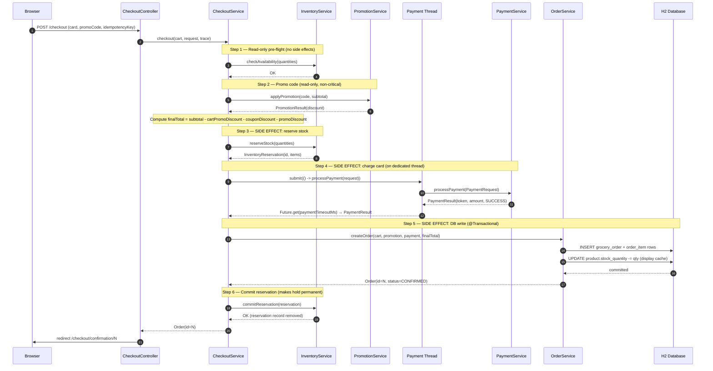
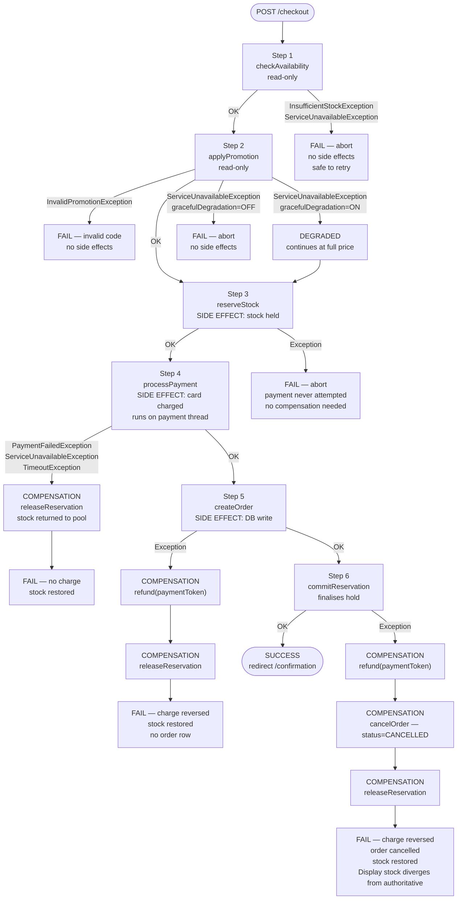
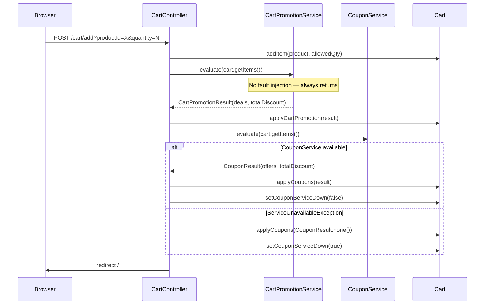
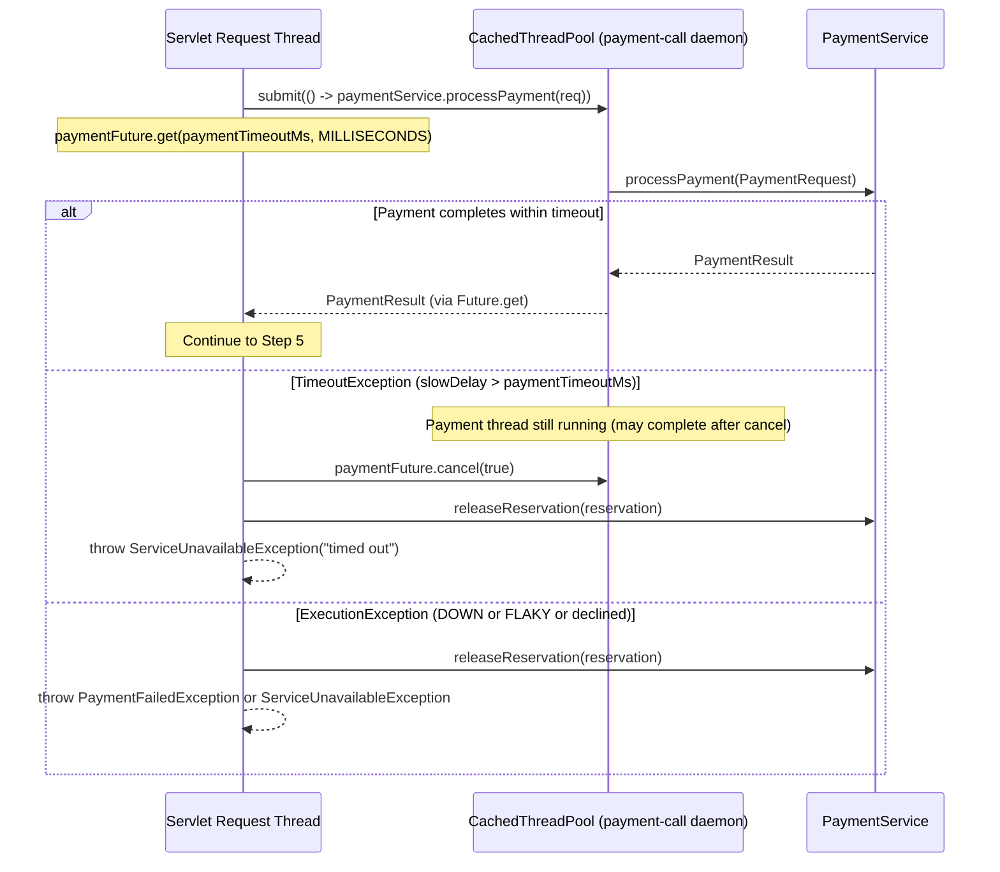
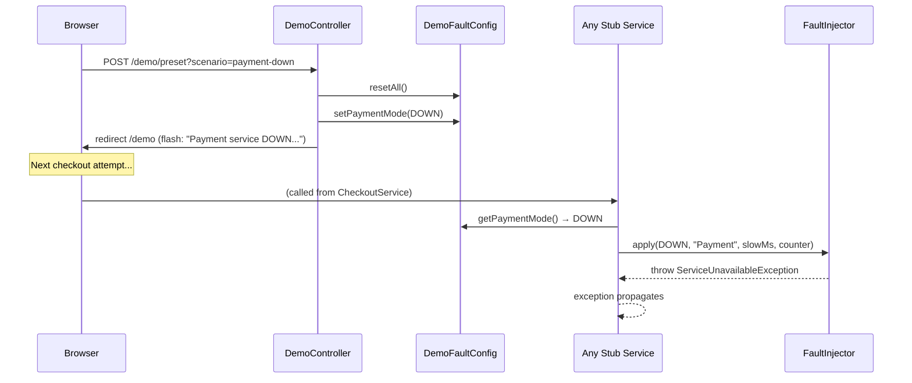
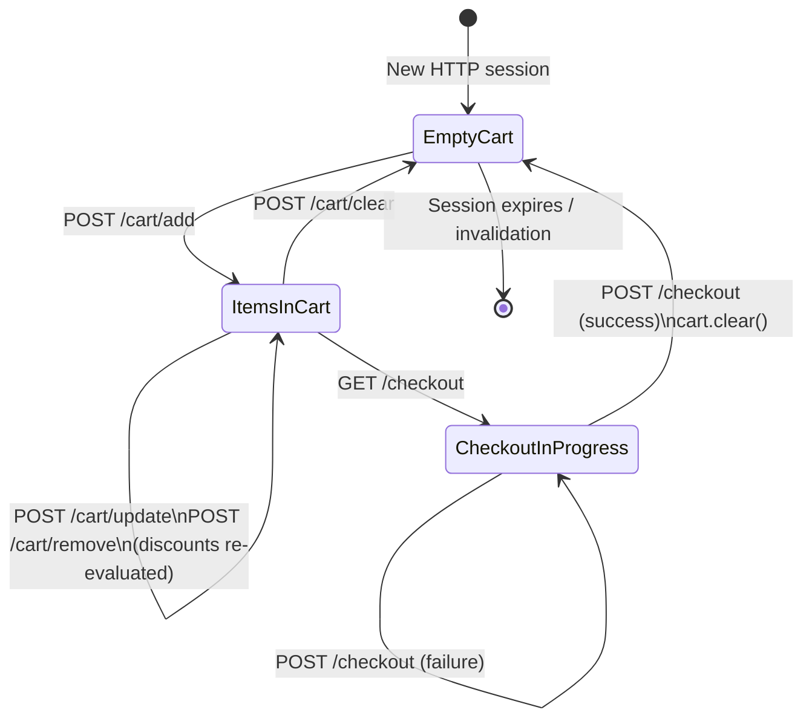
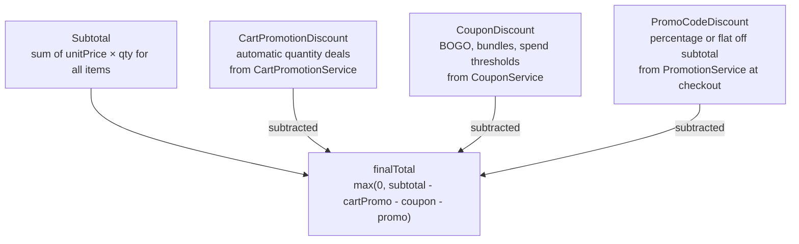
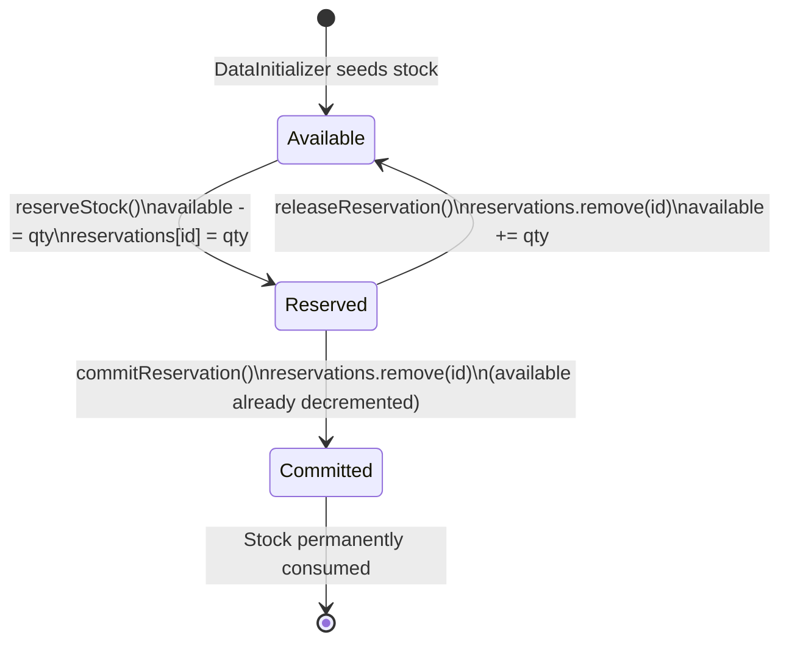
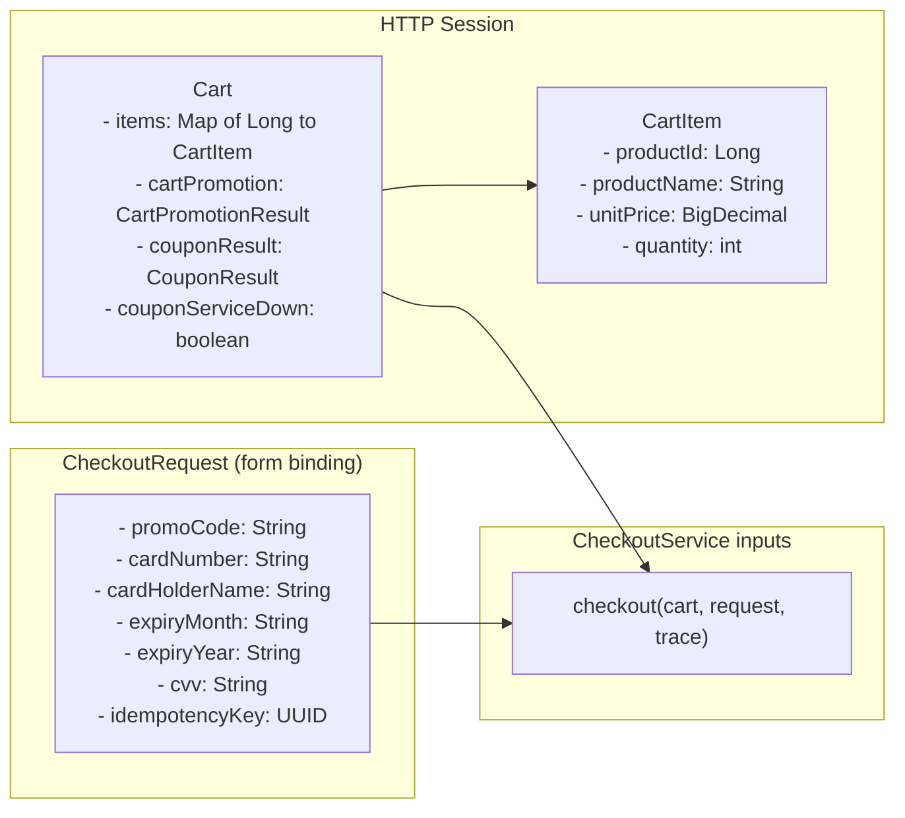
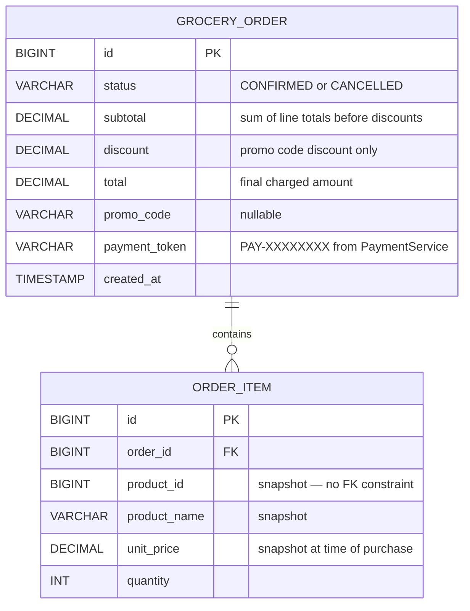

# Data Flow

This document traces the runtime data flows through the application: the checkout saga (the centrepiece), the cart mutation and discount pipeline, the fault injection path, and the session lifecycle.

---

## Contents

1. [Checkout Saga — Happy Path](#checkout-saga--happy-path)
2. [Checkout Saga — Compensation Paths](#checkout-saga--compensation-paths)
3. [Cart Mutation and Discount Pipeline](#cart-mutation-and-discount-pipeline)
4. [Payment Thread Isolation](#payment-thread-isolation)
5. [Fault Injection Data Path](#fault-injection-data-path)
6. [Session Lifecycle](#session-lifecycle)
7. [Discount Calculation Breakdown](#discount-calculation-breakdown)
8. [Stock State Machine](#stock-state-machine)
9. [Data Models](#data-models)

---

## Checkout Saga — Happy Path

`CheckoutService.checkout()` coordinates six steps across three external services. The method is intentionally not `@Transactional` — the saga spans system boundaries that cannot share a JDBC transaction.

---

## Checkout Saga — Compensation Paths

Each step that carries a side effect defines an explicit compensation. Compensations fire in reverse step order.

### Compensation map

| Failure at | Compensations fired (in order) | Money moved? | Order created? | Stock released? |
|---|---|---|---|---|
| Step 1 — checkAvailability | None | No | No | N/A |
| Step 2 — applyPromotion (hard fail) | None | No | No | N/A |
| Step 2 — applyPromotion (graceful) | None — continues DEGRADED | No | No | N/A |
| Step 3 — reserveStock | None | No | No | N/A — never reserved |
| Step 4 — processPayment (any failure) | releaseReservation | No | No | Yes |
| Step 5 — createOrder | refund → releaseReservation | Reversed | No | Yes |
| Step 6 — commitReservation | refund → cancelOrder → releaseReservation | Reversed | Cancelled | Yes |

---

## Cart Mutation and Discount Pipeline

Every cart write (add, update, remove) and every `GET /cart` call triggers `refreshDiscounts()`. Two discount streams are evaluated in sequence.

`CartPromotionService` is never fault-injected and always succeeds. `CouponService` is fault-injectable; failures are caught gracefully — the cart continues working with zero coupon discount and a `couponServiceDown` flag set for the UI.

---

## Payment Thread Isolation

Payment is the only external call with dedicated thread isolation and a hard deadline. All other external calls run on the servlet request thread.

Inventory, promotion, and coupon calls have no equivalent protection. A slow inventory response blocks the servlet thread for the full `slowDelayMs` duration with no timeout escape.

---

## Fault Injection Data Path

`DemoController` writes `DemoFaultConfig`; stubs read it on each call; `FaultInjector.apply()` translates the mode into behaviour.

`FaultMode.FLAKY` uses a per-service `AtomicInteger` counter: even-numbered calls throw, odd-numbered calls pass through. Counters reset when `resetAll()` is called via the "All Normal" preset.

---

## Session Lifecycle

`Cart` is a `@SessionScope @Component`. It implements `Serializable` so it can survive session persistence (e.g. if the servlet container serializes sessions to disk). `CartItem` also implements `Serializable` for the same reason.

---

## Discount Calculation Breakdown

Three discount streams combine to produce the `finalTotal` charged at payment. They are applied in this order:

`Cart.getEffectiveTotal()` returns `subtotal - cartPromotionDiscount - couponDiscount` (used for display). `CheckoutService` applies the promo code discount on top at runtime, producing `finalTotal` which is what the payment service charges.

The floor is zero — a combination of discounts can never result in a negative charge.

---

## Stock State Machine

`releaseReservation` is never fault-injected. Compensations must succeed unconditionally — a faulted release would leave stock permanently locked with no mechanism for recovery in the demo.

---

## Data Models

### Cart → CheckoutService data flow

### Order persistence model

`ORDER_ITEM` stores a snapshot of product data rather than a foreign key. This means the order record is self-contained and survives product deletions, price changes, or catalogue reorganisations.
